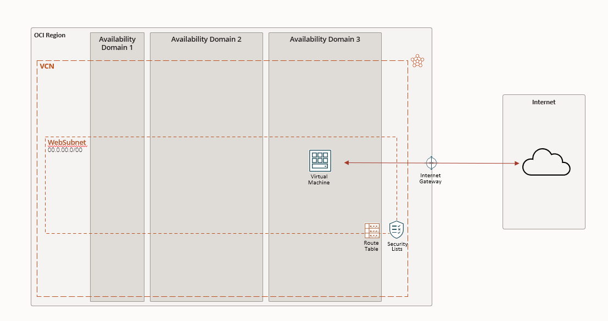

# Despliegue Básico en OCI con Terraform

En esta sección, crearemos el conjunto más sencillo de recursos de Oracle Cloud Infrastructure (OCI), comenzando con un compartimento, una Virtual Cloud Network (VCN) y una subred en esta VCN. La subred será regional, cubriendo todos los dominios de disponibilidad (AD1-AD3). Dentro de esta subred pública, anidaremos una VM para el servidor web. Una subred pública significa que la VM tendrá una IP pública asociada, exponiendo la VM a Internet a través de una Internet Gateway y una tabla de rutas adecuada.

## Objetivo

Después de este despliegue, una lista de seguridad básica permitirá el acceso desde Internet a la VM a través del protocolo SSH (puerto 22) y los protocolos HTTP/HTTPS (puertos 80 y 443). Para la provisión del software, utilizaremos `null_resource` y la capacidad de `remote-exec` del proveedor nulo de Terraform. Terraform instalará un servidor HTTP con contenido en la página raíz. Como resultado, después de ejecutar `terraform apply` exitosamente, deberíamos poder visitar la dirección IP pública de la VM con nuestro navegador web y esperar el contenido de una página sencilla: "¡Bienvenido a Example.com! Este es WEBSERVER1."

## Estructura del Repositorio

- **Compartment**: Un compartimento para aislar los recursos.
- **VCN (Virtual Cloud Network)**: Una red virtual con una subred pública regional.
- **Subnet Pública**: Cubre todos los dominios de disponibilidad (AD1-AD3).
- **VM para WebServer**: Una máquina virtual expuesta a Internet.
- **Internet Gateway y Tabla de Rutas**: Para permitir el tráfico de entrada y salida.
- **Lista de Seguridad Básica**: Permite acceso SSH, HTTP y HTTPS.
- **Provisionamiento con Terraform**: Utiliza `null_resource` y `remote-exec` para instalar el servidor HTTP y desplegar contenido web.

## Cómo Usar

Para utilizar este repositorio y desplegar los recursos en OCI, sigue estos pasos:

1. Asegúrate de tener Terraform instalado y configurado.
2. Clona este repositorio a tu máquina local.
3. Navega al directorio del repositorio clonado.
4. Ejecuta `terraform init` para inicializar el directorio de trabajo de Terraform.
5. Ejecuta `terraform plan` para revisar los cambios que se aplicarán.
6. Ejecuta `terraform apply` para aplicar los cambios. Asegúrate de revisar el plan antes de aplicarlo.
7. Una vez completado, visita la dirección IP pública de la VM con tu navegador para ver el contenido desplegado.

## Contribuir

Si deseas contribuir a este proyecto, por favor haz un fork del repositorio y envía un pull request con tus cambios. Asegúrate de seguir las mejores prácticas y mantener la estructura del proyecto.